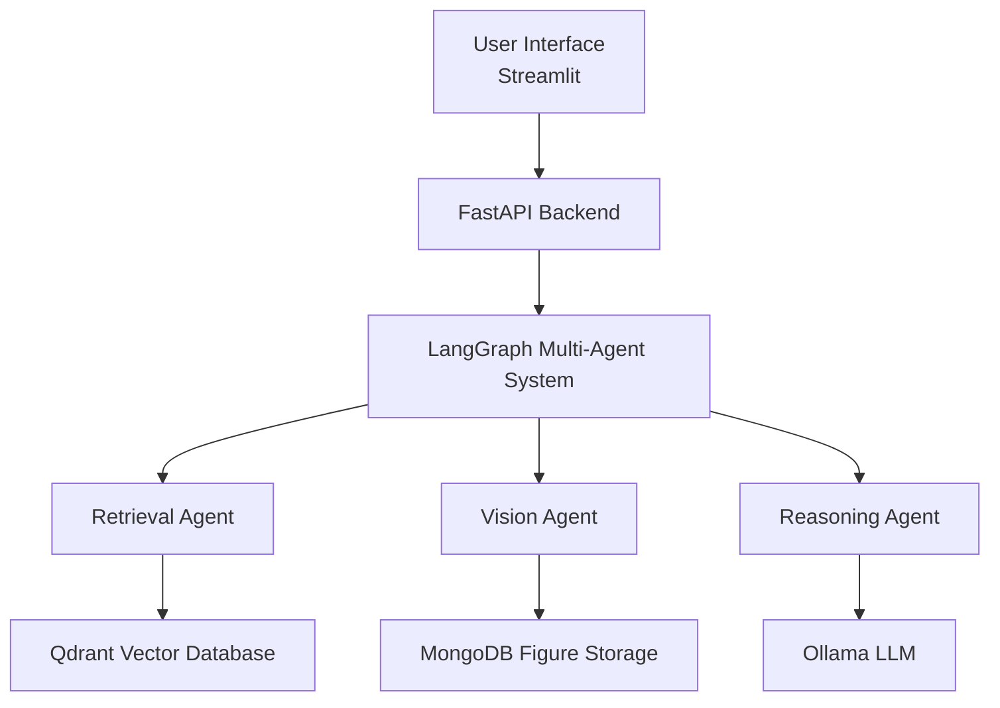
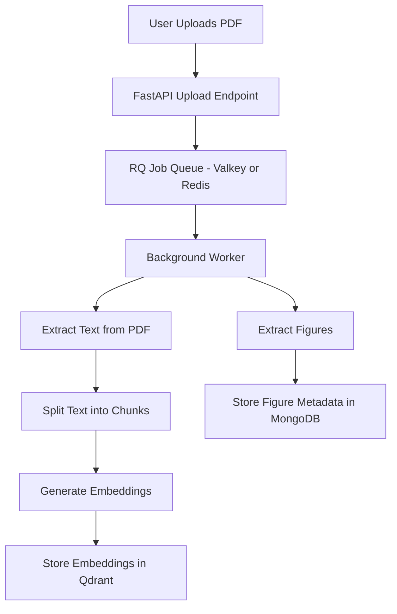
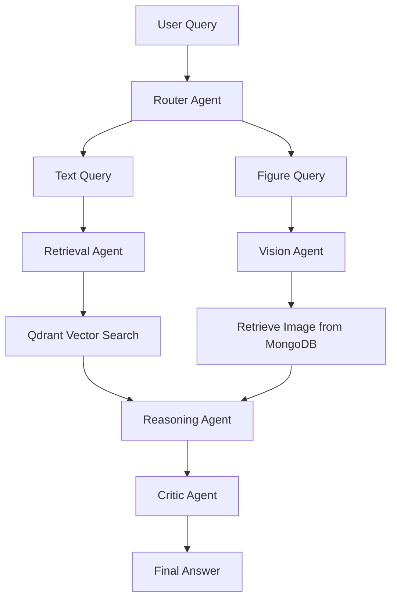
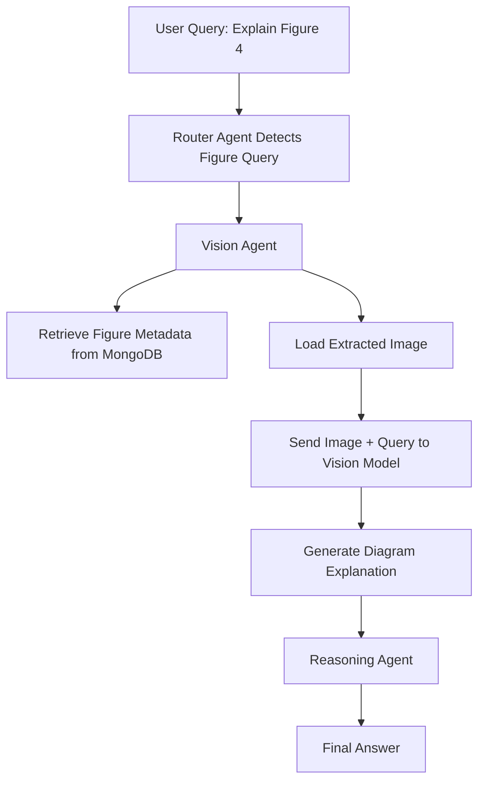
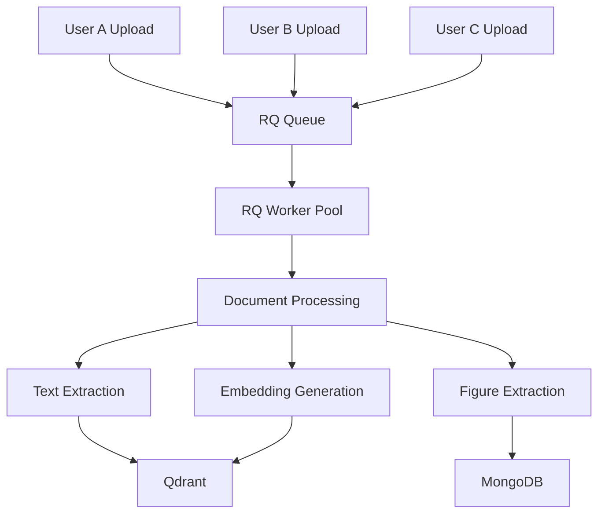
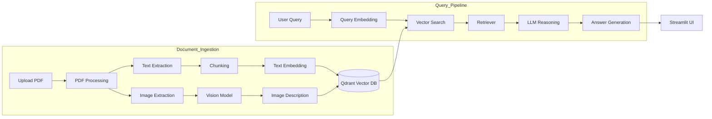

## Short Description

This project is a **multimodal research paper assistant** that allows users to upload academic PDFs and ask questions about both the textual content and the figures contained in the paper. The system is built using a **multi-agent architecture with LangGraph**, where specialized agents handle document retrieval, diagram understanding, reasoning, and answer validation.

Text from PDFs is processed through a **Retrieval-Augmented Generation (RAG) pipeline** with vector embeddings stored in **Qdrant**, enabling efficient semantic search over large research papers. Figures are detected during document processing and stored with metadata in **MongoDB**, allowing the system to retrieve specific diagrams when queries reference them.

When a user asks questions such as *“Explain Figure 4”* or *“Describe the architecture diagram”*, the system retrieves the relevant image and uses a **vision model** to generate an explanation. The pipeline also supports **asynchronous document processing and concurrent users** through background workers using **RQ and Valkey (Redis)**.

The result is an intelligent system capable of answering complex questions about research papers, including interpreting diagrams, model architectures, and experimental results—capabilities that traditional text-only RAG systems often struggle to provide.

## Motivation

Modern LLM platforms such as ChatGPT allow users to upload PDFs and ask questions about them. However, these tools operate as **closed systems** and provide limited control over how documents are processed, retrieved, and analyzed. This project was created to explore a **fully customizable and scalable research-paper understanding system** that overcomes several limitations of standard PDF-based LLM interactions.

### 1. Customizable Retrieval and Processing

Most LLM platforms hide the internal document processing pipeline. This project allows developers to fully control components such as:

- Document chunking strategies
- Embedding models
- Vector databases
- Retrieval pipelines
- Agent orchestration

This makes the system highly adaptable for research and experimentation.

### 2. Diagram-Aware Question Answering

Research papers often contain critical information in **figures, architecture diagrams, graphs, and plots**. Traditional PDF question-answering systems mainly focus on text.  
This system explicitly detects and processes figures, enabling queries such as:

- *Explain Figure 4 in the paper*
- *Describe the model architecture diagram*
- *What does the ROC curve show?*

### 3. Scalable Multi-User Architecture

Unlike single-session interactions with online LLM tools, this system is designed with **asynchronous job queues and background workers**, allowing multiple users to upload and process documents simultaneously.

### 4. Research and Experimentation Platform

The project also serves as a practical environment for experimenting with modern AI system design, including:

- Multi-agent workflows with LangGraph
- Vision-language models
- Retrieval-Augmented Generation (RAG)
- Vector databases
- Document processing pipelines

### 5. Local and Privacy-Friendly Processing

Many research papers and documents may contain sensitive or unpublished information. Running the system locally with self-hosted models allows users to analyze documents **without sending data to external APIs**, improving privacy and control.

## ✨ Features

### Multimodal Research Paper Question Answering
Allows users to upload academic PDFs and ask questions about both the textual content and figures contained in research papers.

### Multi-Agent Architecture (LangGraph)
Implements an agent-based workflow where specialized agents handle tasks such as query routing, document retrieval, vision analysis, reasoning, and response validation.

### Retrieval-Augmented Generation (RAG)
Extracts text from PDFs, converts them into embeddings, and stores them in a vector database (**Qdrant**) for efficient semantic search and accurate context retrieval.

### Figure Detection and Diagram Understanding
Automatically detects figures from research papers and enables queries such as:
- *Explain Figure 4*
- *Describe the architecture diagram*
- *What does the ROC curve represent?*

### Vision-on-Demand Processing
Vision models are invoked **only when queries reference figures or diagrams**, reducing unnecessary model usage and improving system efficiency.

### Vector Search with Qdrant
Uses a high-performance vector database to retrieve the most relevant document chunks for answering user queries.

### Figure Metadata Storage with MongoDB
Stores figure numbers, page numbers, and image paths in **MongoDB**, enabling efficient retrieval of figures during vision-based queries.

### Asynchronous Document Processing
Uses **RQ workers with Valkey (Redis)** to process document ingestion tasks in the background without blocking the main application.

### Concurrent Multi-User Support
Supports multiple users uploading and querying documents simultaneously using asynchronous APIs and background job queues.

### Modular and Extensible Architecture
The agent-based design makes it easy to integrate new tools such as additional retrieval strategies, vision models, or reasoning modules.

### Local Deployment Support
The entire system can run locally using open-source models and databases, making it privacy-friendly and suitable for sensitive research documents.

### Full-Stack Application
Includes a backend built with **FastAPI** and a simple frontend interface using **Streamlit** for document upload and querying.

## 🏗️ Architecture

The system follows a **modular multimodal RAG architecture** that combines document processing, vector retrieval, vision analysis, and multi-agent reasoning.

The pipeline is divided into two main stages:

- **Document Ingestion Pipeline** – processes uploaded PDFs  
- **Query Processing Pipeline** – answers user questions

## High-Level System Architecture



## Document Ingestion Pipeline


---

# Query Processing Pipeline


---

# Vision-Based Figure Understanding


---

# Multi-User Processing Architecture

# Full Architecture Diagram

## 🧰 Technology Stack

| Component | Technology |
|----------|------------|
| Backend API | FastAPI |
| Agent Framework | LangGraph |
| Vector Database | Qdrant |
| Metadata Storage | MongoDB |
| Background Jobs | RQ |
| Queue Backend | Valkey (Redis) |
| Embeddings | Ollama |
| Vision Model | Multimodal LLM |
| Frontend | Streamlit |

## Installation

Follow these steps to run the project locally.

### 1. Clone the Repository

```bash
git clone https://github.com/yourusername/multimodal-research-assistant.git
cd multimodal-research-assistant
```

---

### 2. Create a Virtual Environment

```bash
python -m venv venv
```

Activate it:

**Windows**

```bash
venv\Scripts\activate
```

**Linux / Mac**

```bash
source venv/bin/activate
```

---

### 3. Install Dependencies

```bash
pip install -r requirements.txt
```

---

### 4. Install and Start Required Services

#### Start Qdrant (Vector Database)

Using Docker:

```bash
docker run -p 6333:6333 qdrant/qdrant
```

#### Start MongoDB

Using Docker:

```bash
docker run -p 27017:27017 mongo
```

#### Start Valkey / Redis (Queue Backend)

```bash
docker run -p 6379:6379 redis
```

---

### 5. Start Ollama (Local Models)

Install Ollama and pull required models:

```bash
ollama pull nomic-embed-text
ollama pull phi3
```

Start Ollama:

```bash
ollama serve
```

---

### 6. Start Background Worker

The worker processes document ingestion tasks asynchronously.

```bash
python backend/workers/worker_runner.py
```

---

### 7. Start Backend Server

```bash
uvicorn backend.main:app --reload
```

Backend will run at:

```
http://127.0.0.1:8000
```

---

### 8. Start Frontend

```bash
streamlit run frontend/streamlit_app.py
```

Frontend will run at:

```
http://localhost:8501
```

---

# Usage

### 1. Upload a Research Paper

Open the frontend and upload a **PDF research paper**.

The system will:

- Extract text from the document
- Split the text into chunks
- Generate embeddings
- Store embeddings in **Qdrant**
- Detect figures and store metadata in **MongoDB**

All document processing runs **asynchronously using RQ workers**.

---

### 2. Ask Questions About the Paper

After the document is processed, users can ask questions such as:

- *Summarize the paper*
- *What is the proposed method?*
- *Explain the experimental setup*

The system retrieves relevant document chunks using **vector search** and generates answers using an **LLM**.

---

### 3. Ask Figure-Based Questions

The system also supports diagram-related queries such as:

- *Explain Figure 4*
- *Describe the architecture diagram*
- *What does the ROC curve represent?*

When such queries are detected:

1. The **router agent** sends the query to the **Vision Agent**
2. The corresponding figure is retrieved from **MongoDB**
3. A **vision model** generates an explanation of the diagram

---

### 4. Multi-User Support

The system supports **concurrent users** through:

- Asynchronous **FastAPI endpoints**
- Background document processing using **RQ**
- Task queue management with **Valkey / Redis**
- Parallel vector retrieval from **Qdrant**

This allows multiple users to **upload documents and ask questions simultaneously**.
